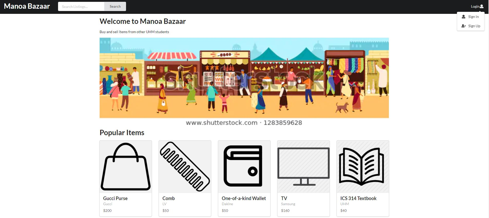
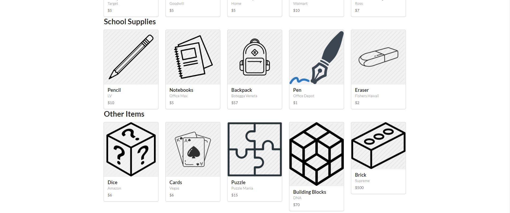
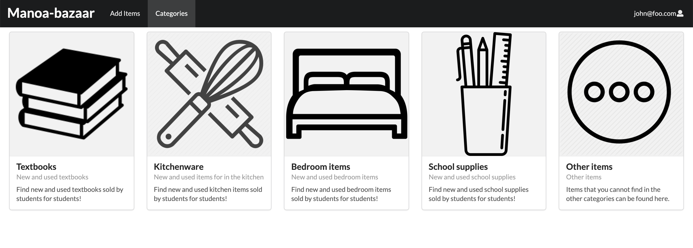
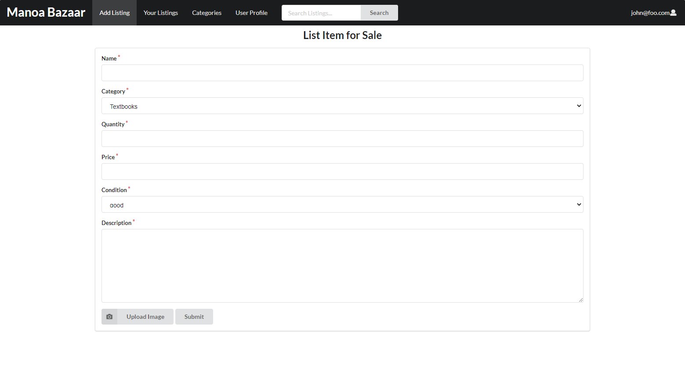

## Table of contents
* [Overview](#overview)
* [Goals](#goals)
* [Features](#features)

## Overview
The Manoa Bazaar is an application for UHM students to facilitate buying and selling of student-related goods and services. 

## Goals
A big problem many students face is the high turnover rate of goods purchased throughout their semesters at UH Manoa. Our goal is to create an interface to help students buy and sell products easily, without having to worry about the usual problems that come with using mainstream reselling companies such as high shipping costs and long shipping times.

## Features

### Landing page  
The landing page is presented to users when they visit the top-level URL to the site.
It displays a list of most highly viewed items that are currently being sold at the top level, followed by categories that display related items.

### Categories page 
The categories page shows ths users 5 categories: textbooks, kitchenware, bedroom items, school supplies, and other items. The first 4 categories contain items that fall into each of the categories, and the "other items" category holds items that don't belong in any of the other categories. Clicking on each of these categories takes you to a page of that category, where the items are listed. This is a basic example of what the categories page will look like. Obviously it will be in style with the whole page, but for right now it is black and white because we haven't defined our theme yet. 

when you click on the category you are looking for, it will take you to a page where the items for that category are listed. For example, the textbook items page shows a list of the different subjects, and then you can click on each subject and see what books are offered in that category. When you click on the textbooks category, an example page of what you could get is this:

### User Profile page 
The user profile is shown when you click on a user's picture or name. It displays their banner picture, icon picture, username, average rating, amount of items currently being listed and total sales, and a short description of their shop. The rating can be clicked to see reviews left by other users.

A better picture of the items currently being listed.

I plan on implementing a separate tab that shows the list of already sold items.

### List Item page 
Page that allows users to list their own items to be displayed on their profiles and respective categories. 
Gives users options to choose caregories, prices, and input descriptions.

