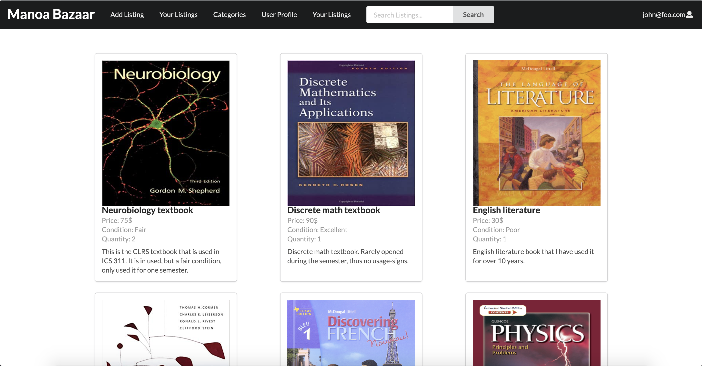
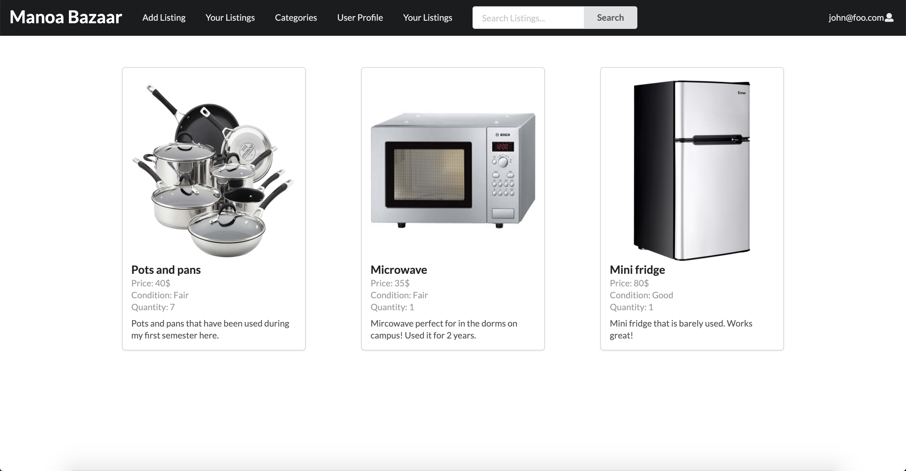
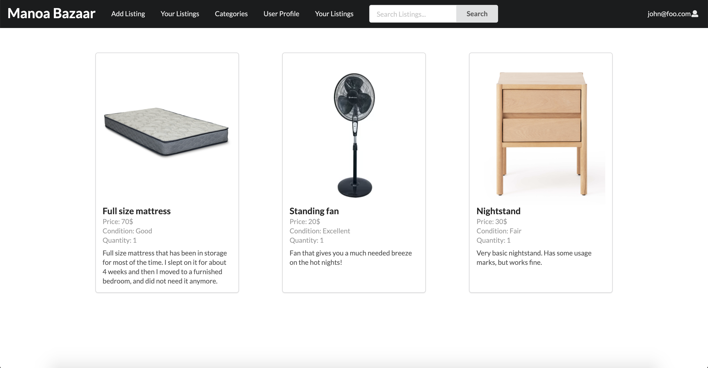

## Table of contents
* [Overview](#overview)
* [Goals](#goals)
* [Features](#features)

## Overview
The Manoa Bazaar is an application for UHM students to facilitate buying and selling of student-related goods and services. 

## Goals
A big problem many students face is the high turnover rate of goods purchased throughout their semesters at UH Manoa. Our goal is to create an interface to help students buy and sell products easily, without having to worry about the usual problems that come with using mainstream reselling companies such as high shipping costs and long shipping times.

## Features
The Manoa Bazaar application will allow users to upload images of the items that they are selling, and each user will have a profile page which lists all of the items that they are selling as well as their rating.

## Team Members

Daniel Kim:
This project seems like an excellent time to practice time management as well as splitting larger problems down into smaller ones. I hope to gain better insights into the software development process as well as improve my communication skills with my teammates. 

Emma van Rossum: 
I am really excited to better my software engineering skills during this project and to work with my peers to create a cool app that has good functionality. I hope to, like Daniel, gain a better understanding of the software engineering process. What I've seen so far of the process in this class, I really liked and thought was really interesting. I think this project is a great first project and I am excited to see what I'll learn from this. 

Lana Kawauchi:
I am currently majoring in ICS . I am looking forward to creating a fully functional website with the help of my project members. Before the pandemic I would often visit swap meets and farmers markets so I am excited to see how we can develop our website into something that can possibly help students in the future. 

Lian Huang:
I am excited about working with my teammates to build a fully functional website from the concepts we learned in class. This project presents a great opportunity to get a feel for what role I’d do well in and enjoy in a team environment. 

## Link to website
[Here](https://manoabazaar.com/) is the link to the website for our application.

### Landing page  
The landing page is presented to users when they visit the top-level URL to the site.
It displays a list of most highly viewed items that are currently being sold at the top level, followed by categories that display related items.

### Categories page 
The [Categories page](https://manoabazaar.com/#/categories) shows ths users 5 categories: textbooks, kitchenware, bedroom items, school supplies, and other items. The first 4 categories contain items that fall into each of the categories, and the "other items" category holds items that don't belong in any of the other categories. Clicking on each of these categories takes you to a page of that category, where the items are listed. 

When you click on the category you are looking for, it will take you to a page where the items for that category are listed. When you click on the [Textbooks](https://manoabazaar.com/#/textbooks) category, the page will display the textbooks currently being offered. It looks like this:

It shows all the textbooks that are offered on the Manoa-Bazaar app. 

When you click on the [Kitchenware](https://manoabazaar.com/#/kitchenware) category, it will take you to the place where all the items that are listed in the kitchenware category are shown. It looks like this:

When you click on the [Bedroom items](https://manoabazaar.com/#/bedroom) category, it will take you to the bedroom items page. The page displays the current bedroom items for sale:

Each of the categories, when clicked on, will have their own page that displays the items that are listed in that category.

### User Profile page 
The user profile is shown when you click on a user's picture or name. It displays their banner picture, icon picture, username, average rating, amount of items currently being listed and total sales, and a short description of their shop. The rating can be clicked to see reviews left by other users. Here is a link to that page: (https://manoabazaar.com/#/user-profile)

A better picture of the items currently being listed.

I plan on implementing a separate tab that shows the list of already sold items.

### List Item page 
Page that allows users to list their own items to be displayed on their profiles and respective categories. 
Gives users options to choose caregories, prices, and input descriptions.

## Milestones

[This](https://github.com/manoa-bazaar/manoa-bazaar/projects/1) is the link to Milestone 1.
[This](https://github.com/manoa-bazaar/manoa-bazaar/projects/2) is the link to Milestone 2.
