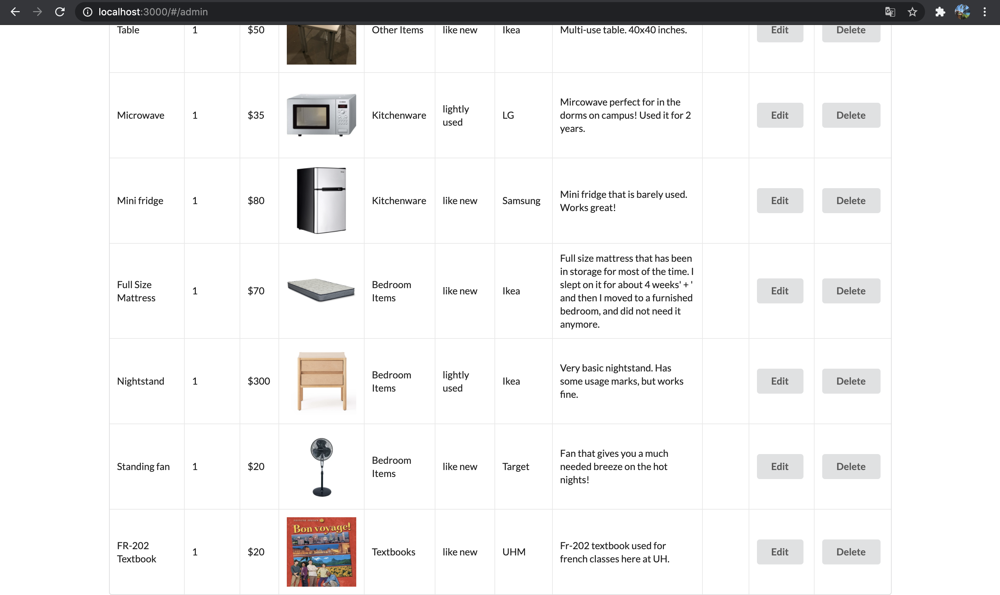

## Table of contents
* [Overview](#overview)
* [Goals](#goals)
* [Features](#features)
* Current App Pages:
  * [Landing Page](#landing-page)
  * [Categories Pages](#categories-page)
  * [User Profile Page](#user-profile-page)
  * [List Item page](#list-item-page)
  * [Admin](#admin)
* [Developer Guide](#developer-guide)
* [Team Members](#team-members)

## Overview
The Manoa Bazaar is an application for UHM students to facilitate buying and selling of student-related goods and services. Check out our [Organization Page](https://github.com/manoa-bazaar) as well as our [Milestone 1](https://github.com/manoa-bazaar/manoa-bazaar/projects/1), [Milestone 2](https://github.com/manoa-bazaar/manoa-bazaar/projects/3), and [Milestone 3](https://github.com/manoa-bazaar/manoa-bazaar/projects/4) pages to follow along with our progress! You can see a development version of our website [here](https://manoabazaar.com/). Our TestCafe badge is .

## Goals
A big problem many students face is the high turnover rate of goods purchased throughout their semesters at UH Manoa. Our goal is to create an interface to help students buy and sell products easily, without having to worry about the usual problems that come with using mainstream reselling companies such as high shipping costs and long shipping times.

## Features
The Manoa Bazaar application will allow users to upload images of the items that they are selling, and each user will have a profile page which lists all of the items that they are selling as well as their rating.

### Landing page  
The [landing page](https://manoabazaar.com/) is presented to users when they visit the top-level URL to the site.
It displays a list of most highly viewed items that are currently being sold at the top level, followed by categories that display related items.


As you can see in the top right of the landing page, there is the option to login or to register. When you click on login, you can login using your credentials. If you don't have am account yet, you can click on sign up. 
The login page looks like this:


The register page looks like this:


### Categories page 
Once the user is logged in, they can see the different categories in which items are offered.
The [Categories page](https://manoabazaar.com/#/categories) shows ths users 5 categories: textbooks, kitchenware, bedroom items, school supplies, and other items. The first 4 categories contain items that fall into each of the categories, and the "other items" category holds items that don't belong in any of the other categories. Clicking on each of these categories takes you to a page of that category, where the items are listed. 


When you click on the category you are looking for, it will take you to a page where the items for that category are listed. When you click on the [Textbooks](https://manoabazaar.com/#/textbooks) category, the page will display the textbooks currently being offered. Each item has a button at the bottom that says "view item", that when clicked on, will take show you the item with all the details belonging to that item. This is the same for all items in each of the categories. In the case of the Textbooks category looks like this:


It shows all the textbooks that are offered on the Manoa-Bazaar app. 
Each of the categories, when clicked on, will have their own page that displays the items that are listed in that category, and each item on that page has a button that links to the view item page.

### User Profile page  
The user profile is shown when you click on a user's picture or name. It displays their banner picture, icon picture, username, average rating, amount of items currently being listed and total sales, and a short description of their shop. The rating can be clicked to see reviews left by other users. Here is a link to that page: [https://manoabazaar.com/#/user-profile](https://manoabazaar.com/#/user-profile)


A better picture of the items currently being listed.

I plan on implementing a separate tab that shows the list of already sold items.

### List Item page 
Page that allows users to list their own items for sale, this item is to be displayed on their profiles and respective categories. 
Gives users options to choose caregories, prices, and input descriptions. 
(available [here](https://manoabazaar.com/#/add))

The add listing page looks like this:


When the information is filled out, you click submit. An alert will appear on the screen that the item has been added successfully. 


Then, the listing appears in the page of the category it was added in:


### Admin
When the current user logged in has the role admin, there are some extra things the admin can do. The admin has an extra tab in the menu that says "[Admin](https://manoabazaar.com/#/admin)". When the user clicks on that page, all the listings will be displayed on that site:


The admin can edit and remove listings. 
The edit looks like this: 


When the new information is put into that page, you click 'submit', and then you'll get a notification that the item has updated successfully (in this case, we've updated the price):


Now, as you can see, the price of the first listing has been updated:


The admin also has the power to remove items. The item we added in Add Listing page, the French textbook, appears in the Admin tab:


Then, when you click on remove, it is removed:


### Developer Guide
First, install [Meteor](https://www.meteor.com/install).

Second, visit the [Manoa Bazaar application github page](https://github.com/manoa-bazaar/manoa-bazaar), and click the “Code” button that gives you the option to clone the code to your computer.

Third, clone the code onto your computer and name the repository.

Fourth, cd into the app/ directory of your local copy of the repoand install the required libraries using

```
$meteor npm install
```
Lastly, run the system with:

```
$meteor npm run start
```
Your application will appear at [http://localhost:3000](http://localhost:3000).

### Initialization
There will be a default set of data that will be created the first time the app runs. 
If you add your own item listings it should appear in the terminal after you reset the application using.
```
$meteor reset
```

### Development History 
Milestone 1: [Click Here](https://github.com/manoa-bazaar/manoa-bazaar/projects/1)

The goal for Milestone 1 was to complete the development of various pages such as the landing page, user profile page, etc. The website was also deployed with a unique url.

Milestone 2: [Click Here](https://github.com/manoa-bazaar/manoa-bazaar/projects/3)

The goal of Milestone 2 is to improve the website's functionality by adding additional pages and implementing realistic datasets. 

Milestone 3: [Click here](https://github.com/manoa-bazaar/manoa-bazaar/projects/4)

The goal of Milestone 3 is to have a functional website that satisfies the goals of our project. 

## Team Members


Daniel Kim:
This project seems like an excellent time to practice time management as well as splitting larger problems down into smaller ones. I hope to gain better insights into the software development process as well as improve my communication skills with my teammates. 


Emma van Rossum: 
I am really excited to better my software engineering skills during this project and to work with my peers to create a cool app that has good functionality. I hope to, like Daniel, gain a better understanding of the software engineering process. What I've seen so far of the process in this class, I really liked and thought was really interesting. I think this project is a great first project and I am excited to see what I'll learn from this. 


Lana Kawauchi:
I am currently majoring in ICS . I am looking forward to creating a fully functional website with the help of my project members. Before the pandemic I would often visit swap meets and farmers markets so I am excited to see how we can develop our website into something that can possibly help students in the future. 


Lian Huang:
I am excited about working with my teammates to build a fully functional website from the concepts we learned in class. This project presents a great opportunity to get a feel for what role I’d do well in and enjoy in a team environment. 


